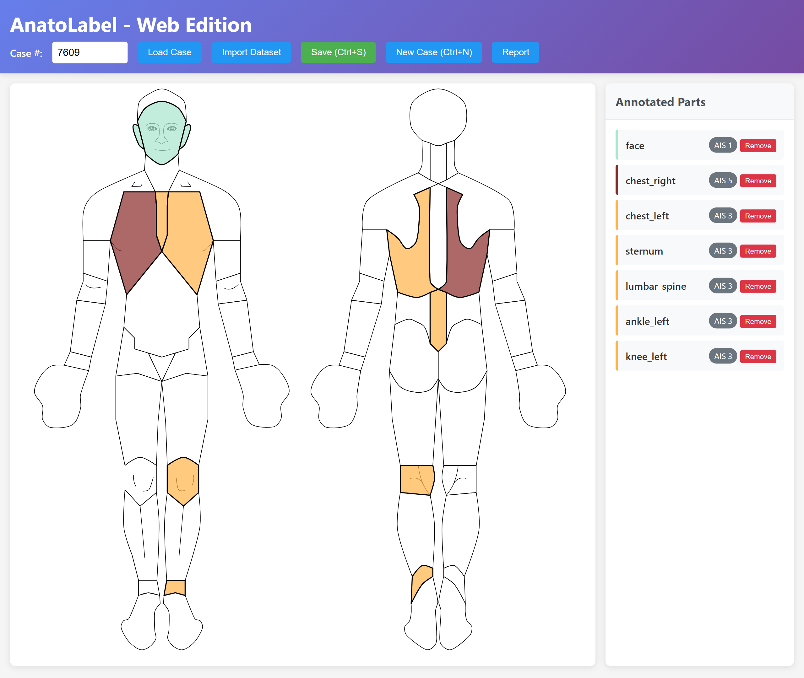
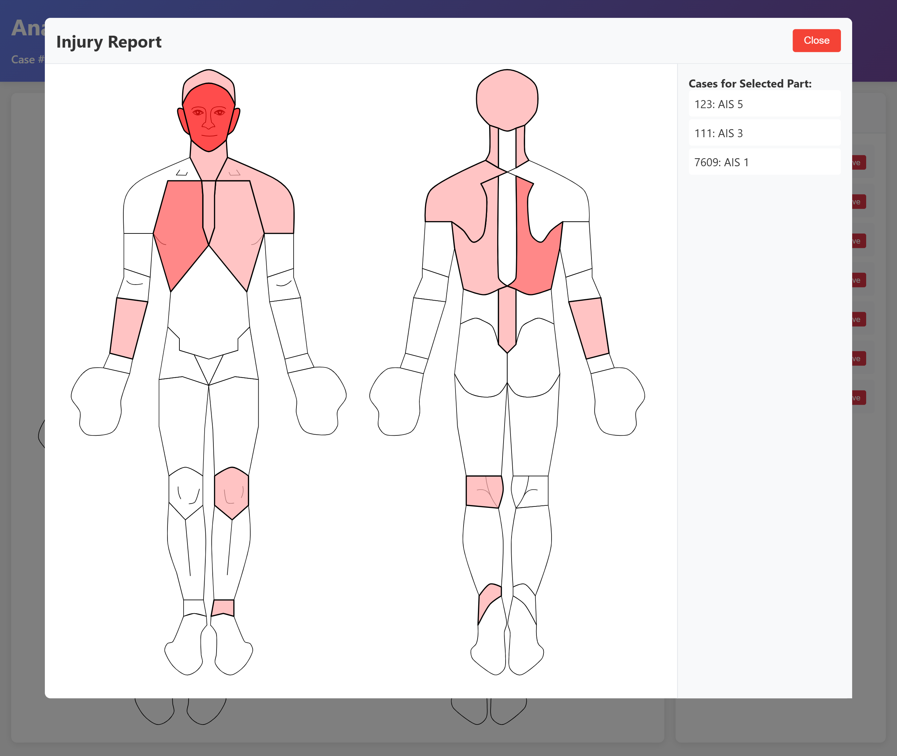

# AnatoLabel - Web Edition

AnatoLabel is a web-based tool for annotating anatomical regions with Abbreviated Injury Scale (AIS) levels. Users can click on predefined body parts in an interactive SVG, assign an AIS score, manage multiple cases, and save annotations to a JSON file. The tool also provides a report feature to visualize injury frequency and severity across all cases.

---

## Screenshots

**Annotation Interface**



**Injury Report**



---

## Features

- **Interactive Annotation**
  - Clickable body parts on an SVG anatomical diagram.
  - Enter a case number, load or start annotating immediately.
- **AIS Level Assignment**
  - Click a body part to open a modal for AIS score (1-6).
  - Select AIS level via buttons or number keys (1-6).
  - Confirm with Enter or "Confirm" button; cancel with Esc or "Cancel".
- **Toggle Annotation**
  - Clicking an already annotated part removes the annotation.
- **Visual Feedback**
  - Annotated parts are highlighted with a color corresponding to their AIS level.
- **Annotation List**
  - Annotated parts and their AIS levels are listed in a side panel.
- **Data Persistence**
  - Save annotations to a JSON file (`annotations.json`).
  - Annotations are stored per case number.
- **Case Management**
  - Start a new case (clears current annotations).
  - Import existing datasets from JSON files.
- **Reporting**
  - Generate a summary view showing body parts shaded by injury frequency and severity across all cases.
  - Click on a body part in the report to see a list of cases and their AIS levels.
- **Keyboard Shortcuts**
  - `Ctrl+S`: Save current annotations.
  - `Alt+N`: Start a new case (clear current annotations).
  - `Enter`: Load case annotations or confirm AIS level in the modal.
  - AIS Modal:
    - Number keys `1` to `6`: Select AIS level.
    - `Enter`: Confirm AIS level.
    - `Esc`: Cancel AIS selection.

---

## Requirements

- Python 3.13
- Flask (`pip install flask`)
- A modern web browser (Chrome, Edge, Firefox, etc.)

---

## Setup and Running

1. **Clone the repository:**
    ```bash
    git clone https://github.com/Rahul-Pi/AnatoLabel.git
    cd AnatoLabel
    ```
    Or download the repository as a ZIP and extract it.

2. **Ensure the following files are in the same directory:**
    - `AnatoLabel.py` (the main Flask application)
    - `anatomical_config.py` (configuration for body regions and colors)
    - `Tool_example.svg` (the SVG anatomical diagram)
    - `templates/index.html` (the front end of the application)

3. **Install dependencies:**
    ```bash
    pip install flask
    ```

4. **Run the application:**
    ```bash
    python AnatoLabel.py
    ```
    The app will start at [http://localhost:5000](http://localhost:5000).

---

## 🛠 How to Use

1. **Enter Case Number:**  
   Type a unique case number in the "Case #:" field.

2. **Load or Start Annotating:**  
   - Click "Load Case" to load existing annotations for that case, or start annotating directly for a new case.

3. **Annotate Body Parts:**  
   - Click a body part on the SVG.
   - A modal will appear. Select the AIS level (1-6) using the buttons or number keys.
   - Press Enter or click "Confirm" to save the AIS level.
   - To remove an annotation, click the highlighted body part again.

4. **View Annotations:**  
   - The right panel displays all current annotations for the active case (e.g., "head: AIS 4").

5. **Save Annotations:**  
   - Press `Ctrl+S` or click "Save" to save annotations for the current case to `annotations.json`.

6. **New Case:**  
   - Click "New Case" or use `Alt+N` to clear current annotations and start a new case.

7. **Import Dataset:**  
   - Click "Import Dataset" to load annotations from an existing JSON file. This merges with current data.

8. **Report:**  
   - Click "Report" to view a summary of injury frequencies and severities. Click a body part in the report to see all cases and their AIS levels for that part.

---

## 🤝 Contribute

Contributions are welcome! If you find a bug or have a feature request, please open an issue on the GitHub repository.

---

## 📜 License

This project is licensed under the GNU General Public License v3.0. See the [LICENSE](LICENSE) file for details.